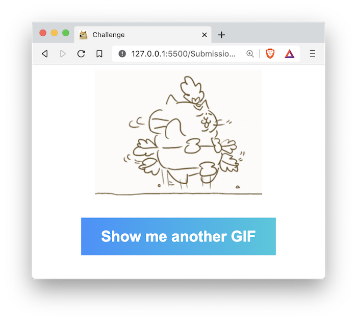
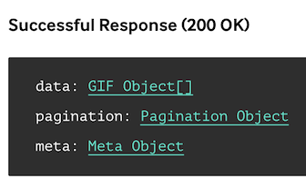

# 01 Exercise - Fetch GIFs from Giphy

## Brief

Use the Giphy API to display a GIF on the page when a button is clicked.

You will read the Giphy API documentation, to get an understanding of what URLs you can use to do certain tasks. Then use the Fetch API to make requests to the Giphy API, to get the details of an image. Finally, you will use the image information to append an image to your HTML web page.

Watch the [Exercise Introduction Video](https://www.loom.com/share/714c6947ba284fd2bd3f9c8b66011eb3) for help on how to get started on this exercise.

## Rationale

When building web applications, it's very common to fetch data from APIs. Being able to call APIs in JavaScript enables you to build sophisticated web applications that can run in the browser.

## Instructions

Part A - Getting started with the Giphy API

 

### Instructions Part A - Getting started with the Giphy API

This challenge will involve calling the Giphy API. When using APIs, it's important to read through the API documentation so you can understand how to interact with it.

1. Sign up for a Giphy API key by following these instructions: [How to get a Giphy API key](docs/giphy-api-key.md).
2. Read through the [Giphy API documentation](https://developers.giphy.com/docs/api#quick-start-guide). We will use the `random` endpoint to display a random GIF
3. Notice how the API documentation for endpoints includes what data will be available in a successful response. `data: GIF Object[]` is suggesting that the response will be an array of GIF objects. You can click the green text in the documentation to see what a `GIF Object` contains.

   

4. Have a play around with the [Giphy API Explorer](https://developers.giphy.com/explorer).
   - Notice how the API key and other query string parameters are added to the API URL, and how the parameters are documented in the API documentation
   - Compare the responses from the API Explorer and what is in the API documentation. Notice the responses are all `JSON`
   - Read the [The Images Object](https://developers.giphy.com/docs/api/schema#image-object) and [Giphy Rendition Guide](https://developers.giphy.com/docs/optional-settings#rendition-guide), and compare this with results from the API Explorer. Think about how you could use this data on your website to display images.

**Acceptance criteria**

- You have generated an API key for Giphy which you can use for API requests
- You have tested different endpoints in the [Giphy API Explorer](https://developers.giphy.com/explorer)
- You have read [The Images Object](https://developers.giphy.com/docs/api/schema#image-object) and [Giphy Rendition Guide](https://developers.giphy.com/docs/optional-settings#rendition-guide)

Part B - Fetch GIFs from Giphy

 

### Instructions Part B - Fetch GIFs from Giphy

Use the Giphy API to display an image when the _Show me another GIF_ button is clicked. Find the `// TODO` comments in `script.js`, and complete the functionality by making a fetch request to the Giphy API.

**Acceptance criteria**

- When the page loads, a random GIF from Giphy should be displayed on the page
- When the _Show me another GIF_ button is clicked, the existing GIF should be replaced with a new random GIF

Optional - Build your own feature

 

### Optional - Instructions Part C - Build your own feature

Implement your own feature on your web page, where you use a different endpoint to Part B. Look through the optional extras section below for inspiration.

**Acceptance criteria**

- An additional feature is implemented on the web page
- The feature is built in a way that does not break previous functionality
- A different endpoint is used from Part B

## Optional extras

If you have finished the previous parts, you could try and complete one or more of the following ideas. You are welcome to try your own ideas too. It is **not** expected that you complete anything below.

**Important** Do not change anything from Part B, as there are automated tests that check it meetings the acceptance criteria. If you are going to complete the following, add it to the page, rather than replacing Part B.

Display a GIF based on user input

Display a form, where the user can enter their mood into a text input. When the form is submitted, display a GIF that relates to their mood.

**Acceptance criteria**

- There should be a form on the page, where a user can type in their mood.
- When the form is submitted, display a GIF on the page that relates to their mood
  - Hint: use the [translate](https://developers.giphy.com/docs/api/endpoint#translate) endpoint

Display GIFs using a Random Word API

Display a list of random words to the user. When they click on a word, display a GIF related to that word.

**Acceptance criteria**

- When the page loads, 10 random words should be displayed to the user
  - Hint: use this [Random Word Generator API](https://random-word-api.herokuapp.com/home)
- When a user clicks one of the random words, a GIF relating to that word is displayed on the page
  - Hint: use the [random](https://developers.giphy.com/docs/api/endpoint#random) endpoint, supplying the word as the `tag`

Connect the Giphy API with other APIs

Browse through [A Curated List of 100 Cool and Fun Public APIs](https://medium.com/better-programming/a-curated-list-of-100-cool-and-fun-public-apis-to-inspire-your-next-project-7600ce3e9b3), are there any opportunities you could generate a GIF using them?

Display a page of trending GIFs

Display trending GIFs on your web page

**Acceptance criteria**

- When the page loads, display 20 trending GIFs
- Advanced: When the _Show me another GIF_ button is clicked, the next 20 trending GIFs are displayed

---

# Submit your exercise

- [ ] Commits are pushed to GitHub
- [ ] Automated tests pass in GitHub

---

## Exercise answer walkthrough

- [Fetch Gifs from Giphy exercise walkthrough](https://www.loom.com/share/5273c4aa3c2a4c44b209587a883649e3)