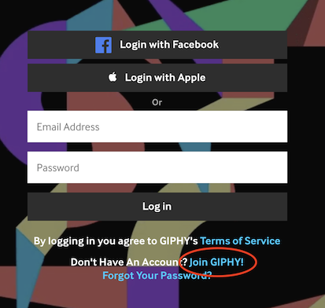
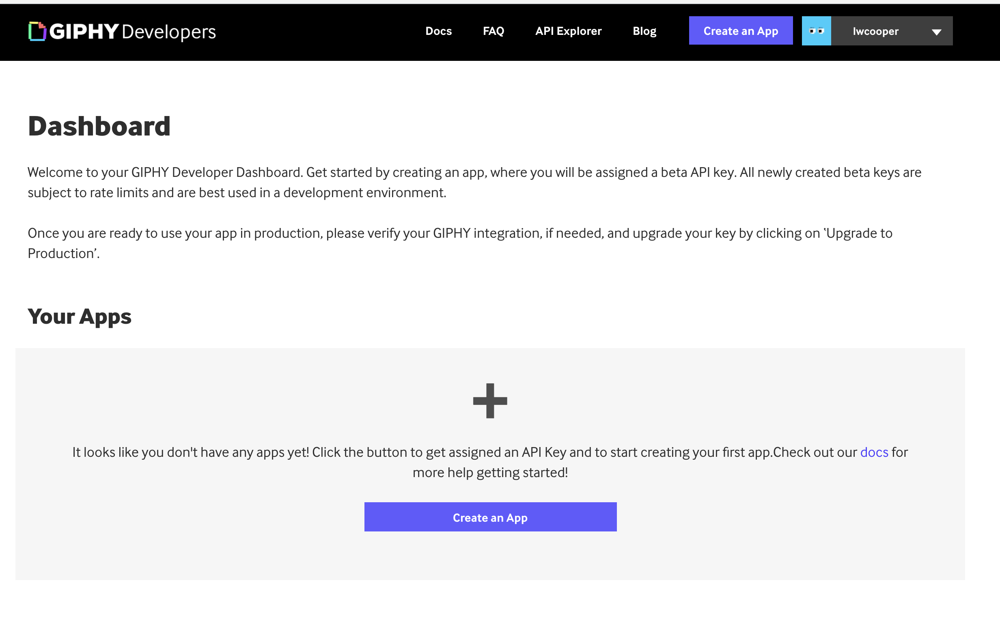
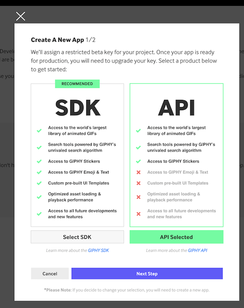

# How to get a Giphy API key

To make calls to the Giphy API, you need to sign up and get an API key.

1. Go to the [Giphy Developers](https://developers.giphy.com) site, and click the shiny blue `Get Started` button in the top right.
1. Create a Giphy account. There is a link hidden after the login form, that says `Join Giphy`
  
1. Once signed up, you should be directed to a `Dashboard`. Click `Create an App`.
  
1. On `Step 1` of `Create an App`, choose `API` and go to the next step
  
1. Give your app a name and description and click `Create App`
1. You will now be given an API key that you can use in your Javascript when making calls to the Giphy API